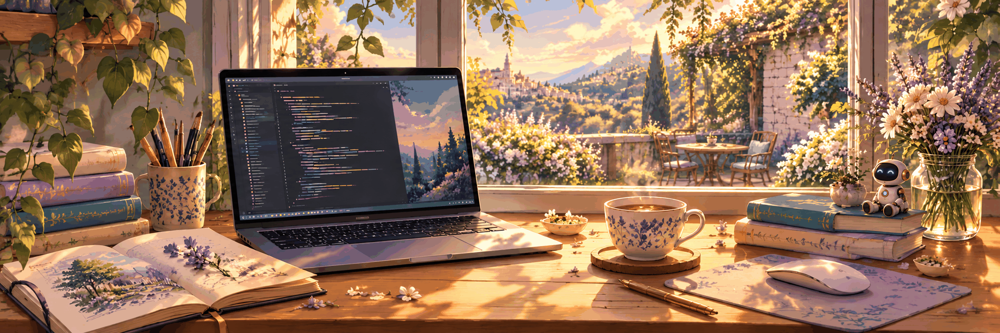

  

<h1 align="center">Hi, I'm Elodie 👋</h1>

  <strong>Robot Control · Vision-Language-Action (VLA) Models</strong> 
  Master's student in Electronic Science and Technology 
  Southern University of Science and Technology (SUSTech)

  <a href="./README.md">🌐 English</a> ·
  <a href="./README.zh-CN.md">🌐 中文</a> ·
  <a href="https://github.com/pyElodie2026">GitHub</a>

---

## 👋 About Me

I am a second-year master's student in **Electronic Science and Technology** at **Southern University of Science and Technology (SUSTech)**, where I also completed my undergraduate studies. My current focus is **robot control** and **vision-language-action (VLA) models**.

I am interested in how robots can connect what they see, what they are asked to do, and how they act in the physical world. This profile is a place to document my learning and, when they are ready to share, my research projects.

## 🔬 Current Focus

| Area | What interests me |
| --- | --- |
| 🤖 Robot control | Methods that turn decisions into robot behavior. |
| 🧠 Vision-language-action models | Connecting visual observations, language instructions, and actions. |

## 🧰 Tools I Use

`Python` · `PyTorch`

## 🎓 Background

- **Now:** Second-year master's student in Electronic Science and Technology at SUSTech.
- **Before:** Undergraduate studies at SUSTech; earlier research experience in **flexible electronics**.

## 🌱 What Comes Next

I am continuing to learn and experiment in robotics and VLA. I will add research notes and projects here as they become ready to share.

<!--
Projects are intentionally hidden for now. When you have work to share,
uncomment and fill in this section:

## 🚀 Featured Projects

| Project | What it does | Links |
| --- | --- | --- |
| Project name | One-sentence description | [Code](https://github.com/pyElodie2026/REPOSITORY) |
-->
